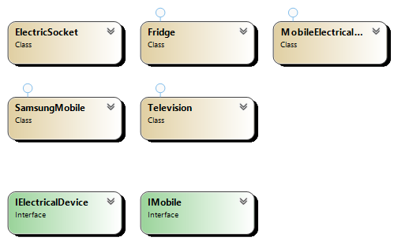

## Overview
The Adapter Pattern allows incompatible interfaces to work together by wrapping an existing class with a new interface. This is particularly useful when integrating a class with an interface that it wasn’t originally designed to work with.

## Participants
- **Target Interface**: Defines the domain-specific interface that clients use.
- **Adapter**: Adapts the interface of the Adaptee to the Target interface.
- **Adaptee**: Has an interface that is incompatible with the Target, but needs adaptation.
- **Client**: Interacts with the Target interface.

## Use Cases
- Integrating new classes with legacy code.
- Allowing incompatible interfaces to work together.
- Wrapping legacy systems to provide more modern interfaces.

## Advantages
- Promotes reuse of existing classes by making them compatible with new interfaces.
- Allows legacy code integration with minimal changes.

## UML Diagram

