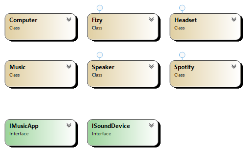

## Overview
The Bridge Pattern decouples an abstraction from its implementation, allowing the two to vary independently. It is useful when both the abstractions and implementations may change over time.

## Participants
- **Abstraction**: Defines the interface for high-level control.
- **Refined Abstraction**: Extends the interface defined by Abstraction.
- **Implementor**: Defines the interface for implementation classes.
- **Concrete Implementor**: Implements the Implementor interface.

## Use Cases
- When you want to separate an object’s abstraction from its implementation.
- Situations where both the abstraction and implementation should be extensible.
- GUI frameworks where you may have different rendering mechanisms.

## Advantages
- Encourages loose coupling between abstraction and implementation.
- Facilitates scalable and maintainable code by allowing both the interface and implementation to evolve independently.

## UML Diagram

