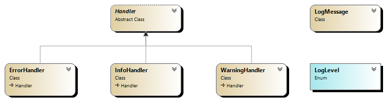

# Chain of Responsibility Pattern

## Overview

The Chain of Responsibility pattern is a behavioral design pattern that allows a request to pass through a chain of handlers. Each handler decides either to process the request or to pass it to the next handler in the chain. This pattern decouples the sender and receiver of a request and gives multiple objects the chance to handle the request.

## Participants

1. **Handler**: Defines an interface for handling requests and optionally implements the successor link.  
2. **ConcreteHandler**: Implements the handler interface and handles the request or passes it to the next handler in the chain.  
3. **Client**: Initiates the request to a handler in the chain.  

## UML Diagram

## Explanation

1. **Handler**: The `Handler` class defines an abstract method `HandleRequest` and maintains a reference to the next handler in the chain.  
2. **ConcreteHandler**: Each concrete handler (`InfoHandler`, `WarningHandler`, `ErrorHandler`) checks if it can handle the request based on the log level. If it can handle the request, it processes the log message. If it cannot, it passes the request to the next handler in the chain.  
3. **Client**: The client sets up the chain of handlers and sends requests. Each request is passed along the chain until it is handled by an appropriate handler.  

### Use Cases

1. **Logging Frameworks**: Different levels of log messages (Info, Warning, Error) can be handled by different loggers.  
2. **Event Handling Systems**: Different event handlers process different types of events.  
3. **Request Processing Pipelines**: Various stages of request processing, such as authentication, validation, and execution.  
