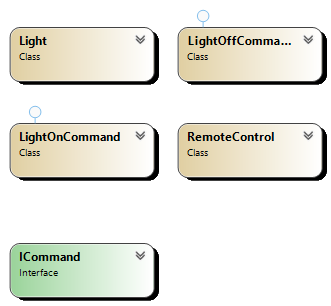

## Overview
The Command Pattern is a behavioral design pattern that turns a request into a stand-alone object that contains all information about the request. This transformation allows for parameterization of methods with different requests, delayed execution, or queuing of requests.

## Participants
- **Command**: Declares the interface for executing an operation.
- **ConcreteCommand**: Defines a binding between a receiver and an action. Implements the execute method by invoking the corresponding operations on the receiver.
- **Receiver**: Knows how to perform the work needed to carry out the request.
- **Invoker**: Responsible for initiating requests. Stores the Command and can trigger its execution.
- **Client**: Creates ConcreteCommand objects and sets their receiver.

## Use Cases
- Undo/redo functionality in applications.
- Queuing operations, such as job scheduling.
- GUI buttons that trigger different operations.

## Advantages
- Decouples the sender and receiver of a request.
- Supports undo and redo operations.
- Allows for easy addition of new commands without modifying existing classes.

## UML Diagram

