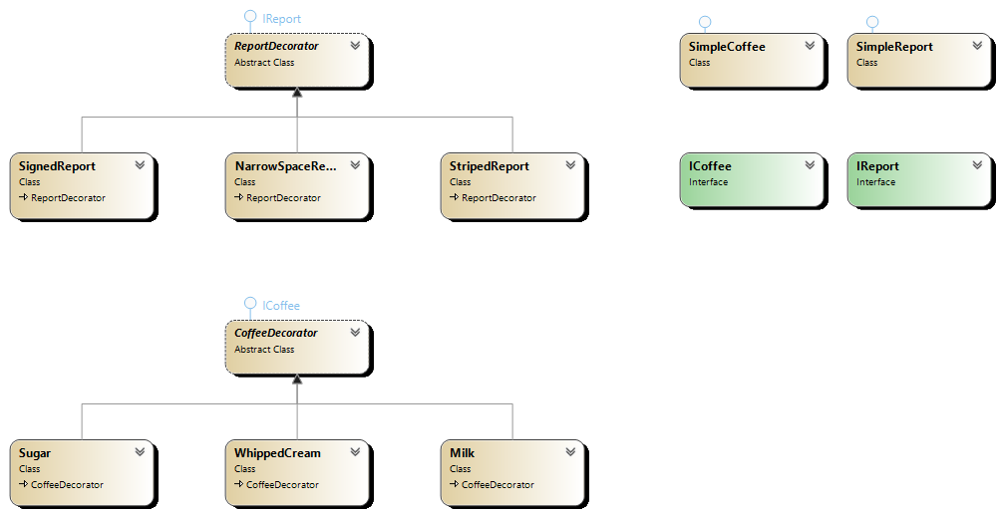

## Overview
The Decorator Pattern adds behavior to objects dynamically without altering their structure. It provides a flexible alternative to subclassing for extending functionality.

## Participants
- **Component**: The interface for objects that can have responsibilities added to them.
- **Concrete Component**: The original object that may have behavior added.
- **Decorator**: Maintains a reference to a Component object and defines an interface conforming to Component's.
- **Concrete Decorator**: Adds responsibilities to the Component.

## Use Cases
- When you want to add responsibilities to objects at runtime.
- Extending behavior without modifying original classes.
- Implementing functionalities like logging, security, or UI features.

## Advantages
- Flexibility to add or remove functionality at runtime.
- Avoids subclassing, reducing the number of classes in the system.
- Enhances code reusability and adheres to the Open/Closed Principle.

## UML Diagram

