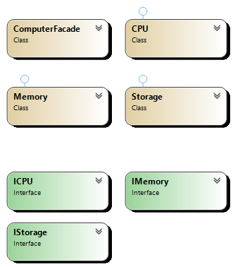

## Overview
The Facade Pattern provides a simplified interface to a complex subsystem. This pattern helps shield the client from complex interactions in subsystems, making the interface easier to use.

## Participants
- **Facade**: Knows which subsystem classes are responsible for a request and forwards requests to the appropriate subsystem.
- **Subsystem Classes**: Handle subsystem functionalities; clients access them only through the Facade.

## Use Cases
- Simplifying interactions with complex subsystems.
- Providing a unified interface to libraries or frameworks.
- Creating a high-level interface for a set of subsystems.

## Advantages
- Reduces client dependency on the detailed workings of subsystems.
- Simplifies the interface for complex subsystems.
- Improves readability and maintainability by centralizing interactions.

## UML Diagram

