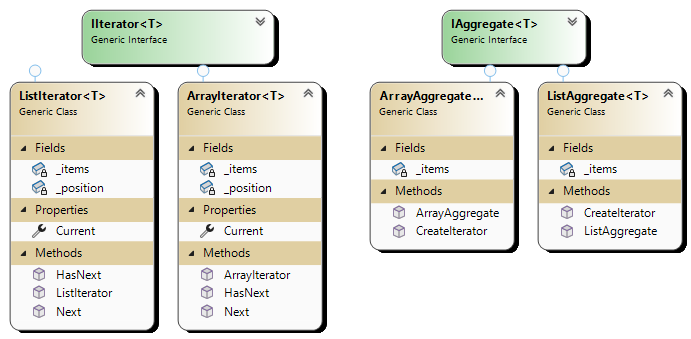

# Iterator Pattern

## Overview

The Iterator pattern is a behavioral design pattern that provides a way to access the elements of an aggregate object sequentially without exposing its underlying representation. It separates the traversal behavior of a collection from the collection itself, making it easier to implement and reuse different traversal algorithms.

## Participants

1. **Iterator**: Interface or abstract class that defines methods for accessing and traversing elements.
2. **ConcreteIterator**: Implements the `Iterator` interface and is responsible for keeping track of the current position in the traversal.
3. **Aggregate**: Interface or abstract class that defines a method to create an iterator object.
4. **ConcreteAggregate**: Implements the `Aggregate` interface and returns an instance of a ConcreteIterator.

## UML Diagram

