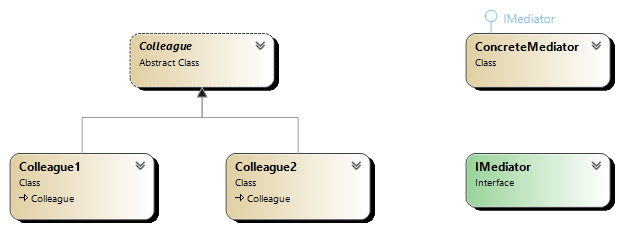

## Overview
The Mediator Pattern centralizes communication between objects by having them communicate through a mediator instead of directly with each other. This reduces dependencies between communicating objects.

## Participants
- **Mediator**: Declares an interface for communication between colleague objects.
- **ConcreteMediator**: Implements cooperative behavior by coordinating communication between colleagues.
- **Colleague**: Objects that interact with each other through the mediator instead of directly.

## Use Cases
- Implementing chat room systems where all users communicate through a central server.
- GUI applications where various controls interact through a mediator.
- Managing workflows between various components.

## Advantages
- Reduces coupling between classes by promoting loose communication.
- Centralizes control of how objects interact.
- Simplifies object communication by eliminating complex dependency chains.

## UML Diagram

