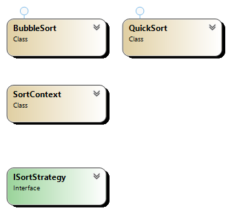

## Overview

The **Strategy Pattern** is a behavioral design pattern that allows an object to choose its behavior or algorithm at runtime. The pattern defines a family of algorithms, encapsulates each one, and makes them interchangeable. This allows the algorithm to vary independently from the clients that use it.

The Strategy Pattern is useful when there are multiple ways of performing an action, and the best approach may depend on the context. It helps avoid hardcoded conditionals and supports open/closed principles by allowing behaviors to be added or modified without altering the client's code.

## Participants

1. **Context**: Maintains a reference to one of the strategies and allows the client to interact with the selected strategy.
   - Responsible for interacting with the appropriate strategy object at runtime.
   
2. **Strategy Interface**: Declares an interface common to all supported algorithms. The context uses this interface to call the strategy.
   - Methods: `execute()`
   
3. **Concrete Strategies**: Implement the strategy interface. Each concrete strategy provides a specific implementation of the algorithm.
   - Multiple classes, each with a distinct algorithm.

## UML Diagram

## Use Cases

- When you need different variations of an algorithm or behavior, such as:
  - Sorting algorithms (quick sort, merge sort, etc.)
  - Different payment methods (credit card, PayPal, etc.)
  - Rendering or encoding formats (PDF, HTML, JSON, etc.)
- When you want to eliminate conditionals or switch-case statements that select different behaviors based on conditions.
- When you need to select the appropriate algorithm based on user preferences or system configurations.

## Advantages

- **Flexibility**: You can easily change or add new strategies without altering the client code.
- **Encapsulation**: The algorithm is encapsulated within a strategy, so the client is decoupled from the actual implementation.
- **Open/Closed Principle**: Supports extension of behavior without modifying existing code, allowing easy integration of new strategies.
- **Avoids Conditional Logic**: Eliminates the need for complex conditionals or switch-case logic, making the code cleaner and easier to maintain.
