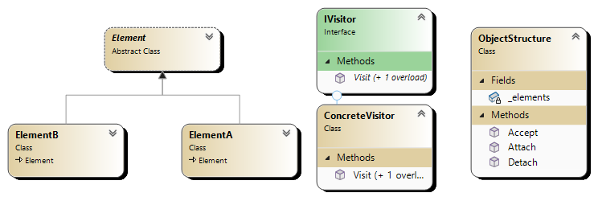

# Visitor Pattern

## Overview

The Visitor pattern is a behavioral design pattern that represents an operation to be performed on the elements of an object structure. It lets you define a new operation without changing the classes of the elements on which it operates.

## Participants

1. **Visitor**: Declares a `Visit` operation for each class of `ConcreteElement` in the object structure.
2. **ConcreteVisitor**: Implements each `Visit` operation, which defines the specific behavior for a particular type of element.
3. **Element**: Defines an `Accept` operation that takes a visitor as an argument.
4. **ConcreteElement**: Implements the `Accept` operation.
5. **ObjectStructure**: Can enumerate its elements and provide a high-level interface to allow the visitor to visit its elements.

## UML Diagram

## Explanation

1. **Visitor**: The `Visitor` interface declares a set of visiting methods for each type of element.
2. **ConcreteVisitor**: Each `ConcreteVisitor` implements the visiting methods for each type of element.
3. **Element**: The `Element` interface declares an `Accept` method that takes a visitor object.
4. **ConcreteElement**: Each `ConcreteElement` implements the `Accept` method by calling the visiting method on the visitor object.
5. **ObjectStructure**: The `ObjectStructure` is a collection of elements which can be iterated over to perform operations.

### Use Cases

1. **Compilers**: Used in the abstract syntax tree to separate algorithms from the object structure.
2. **Object Serialization**: Allows for conversion of complex object structures into a different format (like XML or JSON) without modifying the structures themselves.
3. **UI Components**: Helps in rendering components or gathering metrics from complex UI hierarchies.
