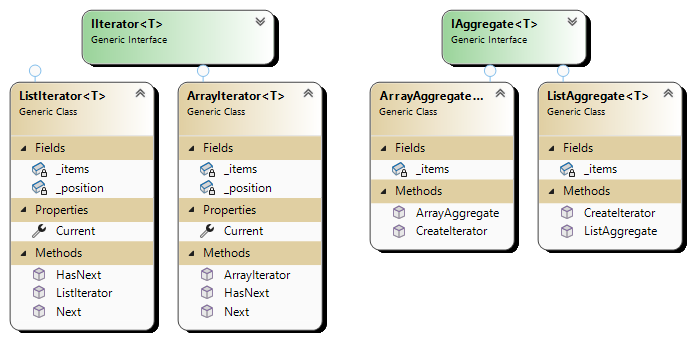

# Iterator Pattern

## Overview

The Iterator pattern is a behavioral design pattern that provides a way to access the elements of an aggregate object sequentially without exposing its underlying representation. It separates the traversal behavior of a collection from the collection itself, making it easier to implement and reuse different traversal algorithms.

## Participants

1. **Iterator**: Interface or abstract class that defines methods for accessing and traversing elements.
2. **ConcreteIterator**: Implements the `Iterator` interface and is responsible for keeping track of the current position in the traversal.
3. **Aggregate**: Interface or abstract class that defines a method to create an iterator object.
4. **ConcreteAggregate**: Implements the `Aggregate` interface and returns an instance of a ConcreteIterator.

## UML Diagram

## Use Cases

**Traversal of Complex Data Structures**: Use the Iterator pattern to traverse complex data structures like trees, graphs, or composite structures without exposing their internal details.
**Unified Interface for Collections**: When you need a unified interface to traverse different types of collections (e.g., arrays, lists), the Iterator pattern provides a consistent way to do so.
**Custom Traversal Algorithms**: If you need custom traversal algorithms (e.g., reverse traversal, skipping elements), you can implement them using the Iterator pattern without modifying the underlying collection.

## Advantages

**Encapsulation**: The Iterator pattern encapsulates the traversal logic, keeping the internal representation of the collection hidden.
**Single Responsibility Principle**: The pattern separates the concerns of collection management and traversal, adhering to the Single Responsibility Principle.
**Flexibility**: You can add new traversal methods or change existing ones without affecting the underlying collection.